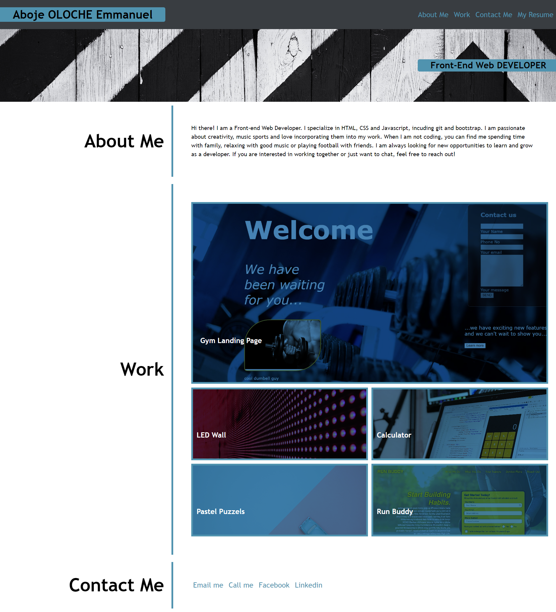

# digital-portfolio

## description
an online portfoilio is a thing emplyers are always looking out for in order to get a first impression of candidates capabilities and thought process. i have therefore created this portfolio along with my github repo showing my commits and code.

## table of contents
1. Header section consisting of the :
    a. Page Heading and 
    b. Nav bar that scrolls to repective sections within the page.
2. Body section consisting of:
    a. Hero (Job role description), 
    b. About me section, 
    c. Works section and 
    d. Contact me.

## technologies used
1. Vs Code, 
2. HTML
3. CSS
4. Git/Github
5. Google Chrome browser

## screenshots

## link to github repo
https://github.com/ollyvent/digital-portfolio.git

## link to deployed application
https://ollyvent.github.io/digital-portfolio/